title: Home

# MkDocs Bootstrap Theme

This project provides [MkDocs] themes for the different Bootstrap themes
provided by the [Bootswatch] project.

## Installation & Usage

Install the collection of themes with pip, which is hopefully how you
installed MkDocs.

    pip install mkdocs-bootswatch

After installation is complete, edit your [mkdocs.yml] config file and set the
[theme] to one of the following Bootwatch themes included. The full list is as
follows:

 - [cerulean](#cerulean)
 - [cosmo](#cosmo)
 - [cyborg](#cyborg)
 - [darkly](#darkly)
 - [flatly](#flatly)
 - [journal](#journal)
 - [litera](#litera)
 - [lumen](#lumen)
 - [lux](#lux)
 - [materia](#materia)
 - [minty](#minty)
 - [pulse](#pulse)
 - [sandstone](#sandstone)
 - [simplex](#simplex)
 - [slate](#slate)
 - [solar](#solar)
 - [spacelab](#spacelab)
 - [superhero](#superhero)
 - [united](#united)
 - [yeti](#yeti)

For example:

    theme: cerulean

Or:

    theme: yeti

As with the base `mkdocs` theme, you can request alternate colors for the
navigation header. Allowed values are `primary` (the default), `dark`, and
`light`:

    theme:
        name: cerulean
        nav_style: dark

## Screenshots

This [documentation] is rendered with the Bootswatch [Flatly](#flatly) theme.
Previews of the other themes can be seen below.

### Cerulean
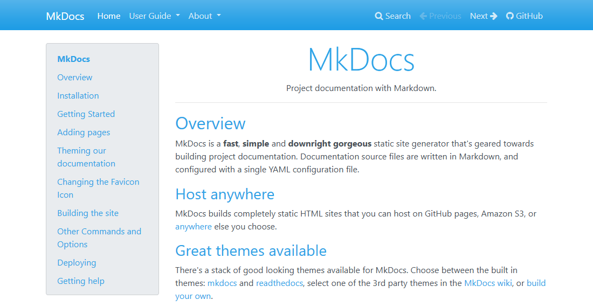

### Cosmo
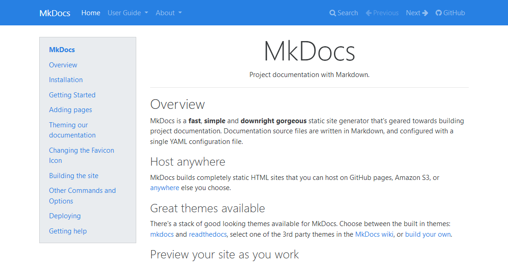

### Cyborg
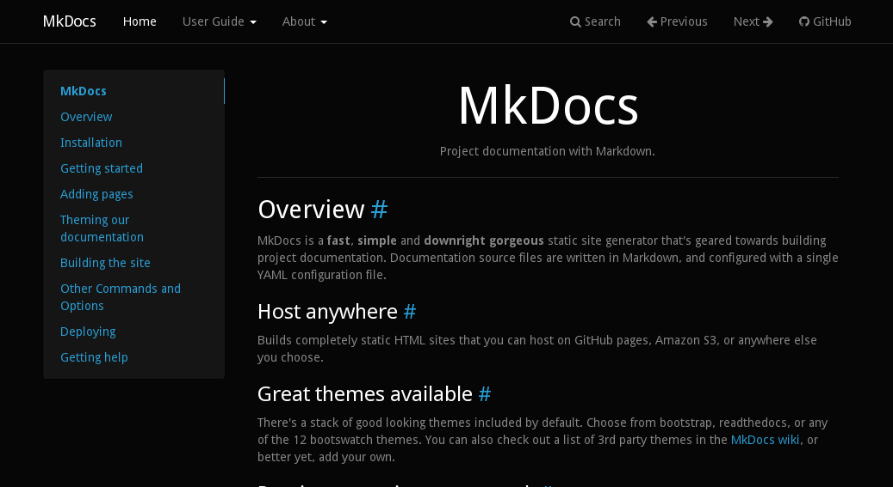

### Darkly
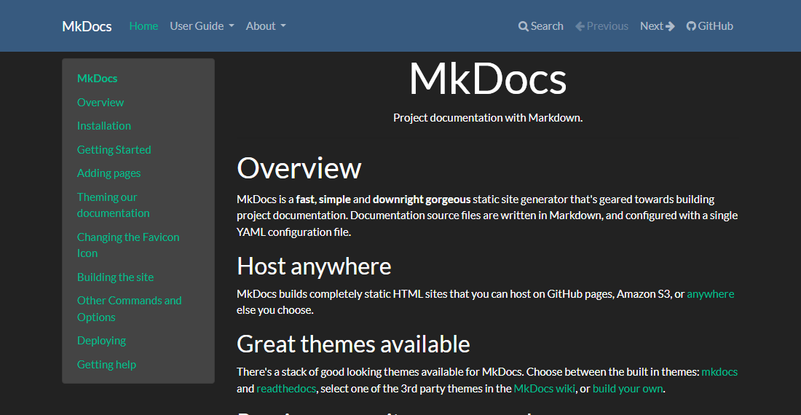

### Flatly
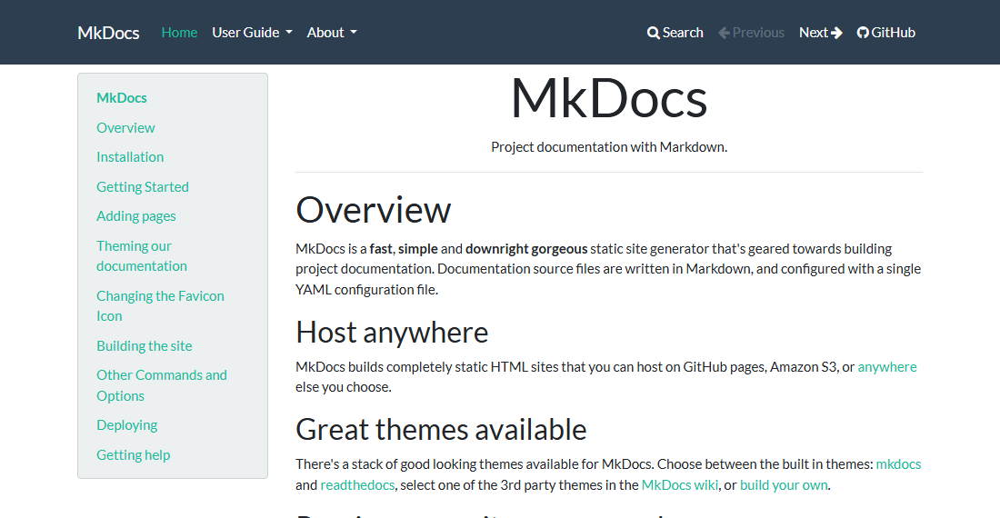

### Journal

### Litera

### Lumen
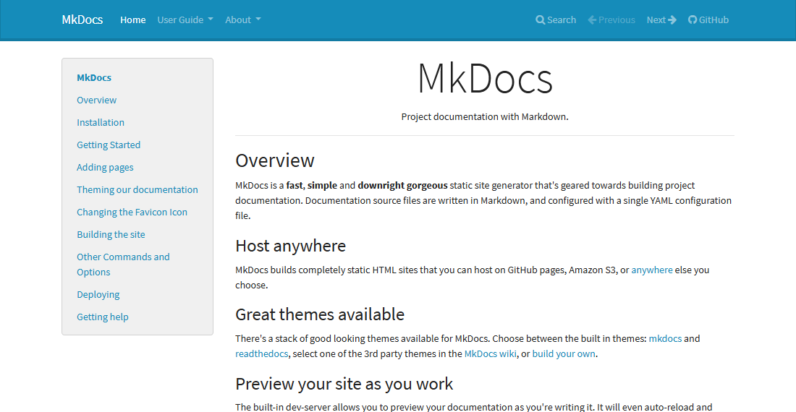

### Lux
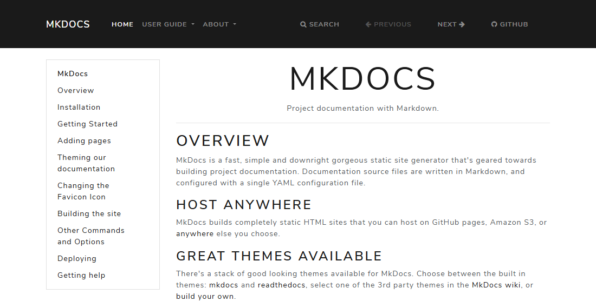

### Materia
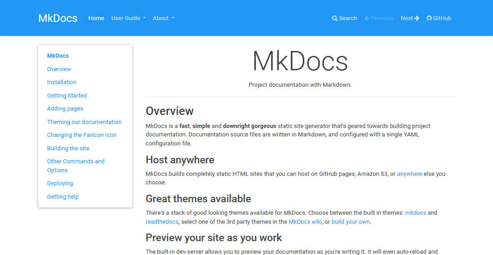

### Minty

### Pulse

### Sandstone
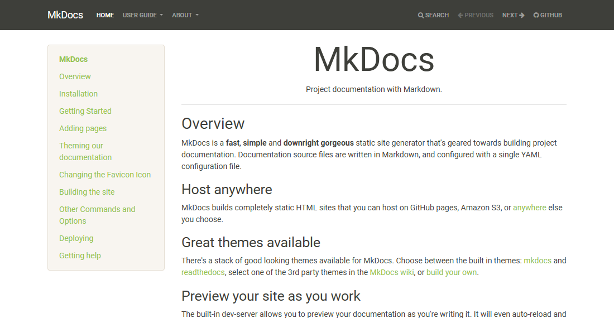

### Simplex
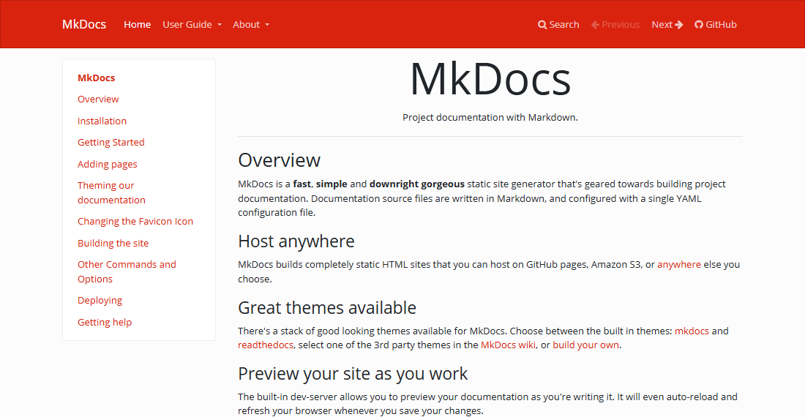

### Slate

### Solar

### Spacelab
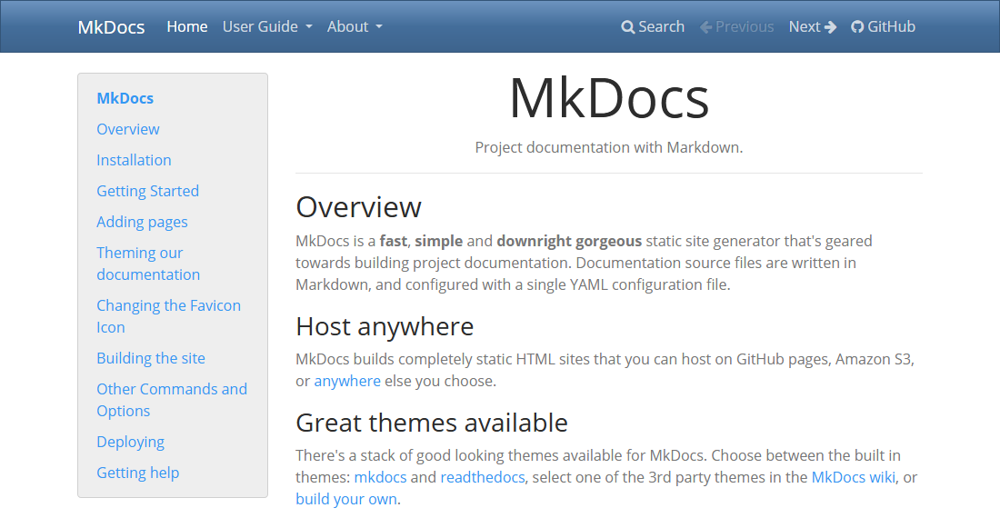

### Superhero

### United
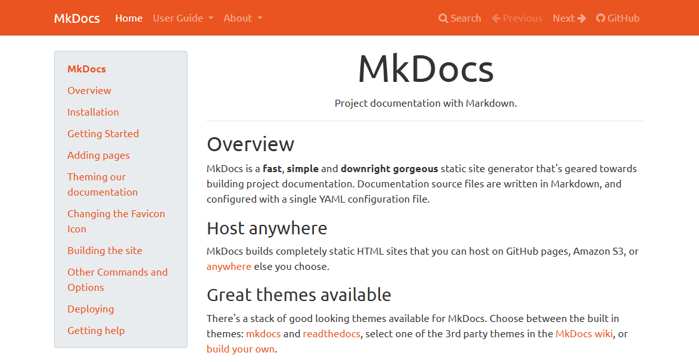

### Yeti
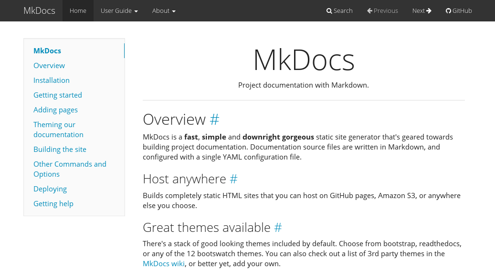

[Mkdocs]: https://www.mkdocs.org
[mkdocs.yml]: https://www.mkdocs.org/user-guide/configuration/
[theme]: https://www.mkdocs.org/user-guide/configuration/#theme
[documentation]: https://mkdocs.github.io/mkdocs-bootstrap/
[Bootswatch]: https://bootswatch.com/
